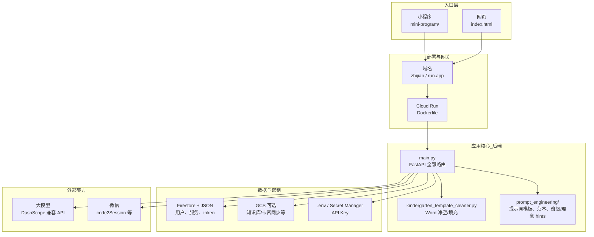
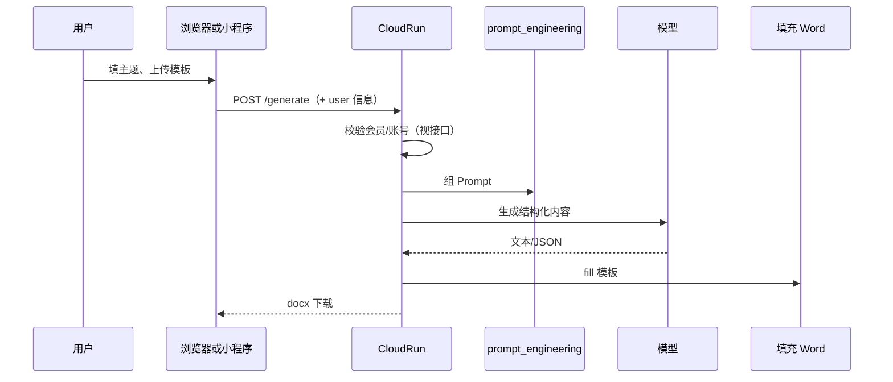

# 幼师智能项目 — 架构脑图（减负版）

> 目的：一眼看清**模块在哪、谁改什么、从哪进**。  
> Obsidian：整份复制进库即可；图用 Mermaid 渲染。

---

## 1. 一句话

**一个后端（`main.py` + Cloud Run）** 同时服务：**网页 `index.html`** 和 **微信小程序**；**AI** 走 DashScope；**用户/会员数据** 在 Firestore + 本地 JSON 双写；**教案风格** 由 `prompt_engineering/` 统一管。

---

## 2. 总模块图（先看这张）

---

## 3. 目录 ↔ 职责（代码写在哪）

| 模块 | 路径 | 干什么 | 你通常什么时候动它 |
|------|------|--------|-------------------|
| **后端主程序** | `main.py` | 所有 HTTP 接口：生成、兑换、健康检查、wxlogin、统计、反馈… | 加接口、改鉴权、接 Firestore |
| **提示词工程** | `prompt_engineering/` + `PROMPT_ENGINEERING.md` | 可复现的 Prompt、参考范本 JSON | 调生成质量、加范本 |
| **Word 引擎** | `kindergarten_template_cleaner.py` | 模板解析、净空、与填充配合 | 改表格规则、导出问题 |
| **网页首页** | `index.html` | 浏览器打开 `/` 看到的纸笺页（表单、统计、兑换、留言） | 改文案、布局、埋点 |
| **小程序** | `mini-program/` | 微信端页面、`app.js`、`utils/request.js`、`pages/*` | 交互、传参、wxlogin |
| **依赖** | `requirements.txt` | Python 包 | 加库时 |
| **容器** | `Dockerfile` | 镜像里怎么启动服务 | 改启动命令、环境 |
| **本地/运营数据** | `user_services.json`、`user_accounts.json`、`redeem_codes.json` 等 | 本地兜底；线上多实例要靠 Firestore/GCS | 谨慎，勿把密钥提交 Git |
| **知识库** | `knowledge_base/`（若存在） | 索引与文档 | RAG/索引脚本 |
| **静态站（另一路）** | `static-www-soulshock/` | Firebase 等静态页，**不是** Cloud Run 主站 | 别和 `index.html` 搞混 |
| **流程备忘** | `Start.md` / `End.md` / `MEMORY.md` | 开工收工、决策 | 协作习惯 |

---

## 4. `main.py` 里大致分块（心里有个地图）

不必记行号，按**功能块**理解即可：

| 块 | 内容 |
|----|------|
| 配置与环境 | `APP_VERSION`、API Key、路径常量 |
| Firestore / JSON | `_load_user_services`、`_save_*`、`user_wxlogin`、token 校验 |
| **生成类** | `/generate`、`/preview`、`/generate-weekly`、`/generate-daily`… |
| **兑换 / 合作方** | `/redeem`、`partner`、webhook |
| **运营** | `/public-stats`、`/track-event`、`/feedback`、`/register-lite` |
| **前端页** | `GET /` → 读 `index.html` |
| **健康** | `/health` |

新增功能时：**先想属于哪一块**，再往对应块里加路由，避免 `main.py` 里乱长。

---

## 5. 「改的什么地方」— 近期容易混的几件事

| 话题 | 事实 |
|------|------|
| **网页首页** | 改的是仓库根目录 **`index.html`**，由 `GET /` 返回；**不是** `static-www-soulshock/` 里那份（除非你又单独部署 Firebase）。 |
| **小程序登录** | **`mini-program/app.js`**（wxlogin）+ **`utils/request.js`**（自动带 `user_token`）；后端是 **`/user/wxlogin`**。 |
| **两域名一样** | 都指向**同一套 Cloud Run**，所以内容一致。 |
| **Claude / Cursor 分叉** | 以 **GitHub `main`** 为准；不要在 `.claude/worktrees/...` 和主目录各改一套，容易「漏合并、重复劳动」。 |

---

## 6. 数据流（生成一次教案）

---

## 7. 你大脑宕机时怎么用这份文档

1. 先想问题属于：**网页 / 小程序 / 后端 / 数据 / 部署** 哪一层。  
2. 打开上表 **第 3 节**，点到对应**路径**。  
3. 若要画图给团队：把本节 **Mermaid** 贴到 **Obsidian** 或 Notion。

---

## 8. 与 `SYSTEM_ARCHITECTURE.md` 的关系

- **`SYSTEM_ARCHITECTURE.md`**：偏 **GCP + 线路**（Obsidian 技术图）。  
- **本文**：偏 **人脑减负 + 文件落点 + 谁改哪**。

两份可以都放在 `docs/`，需要时一起打开。
