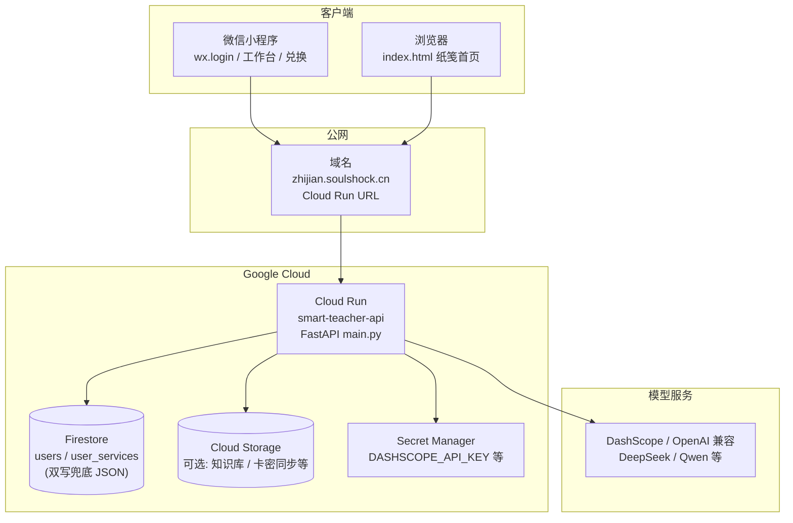
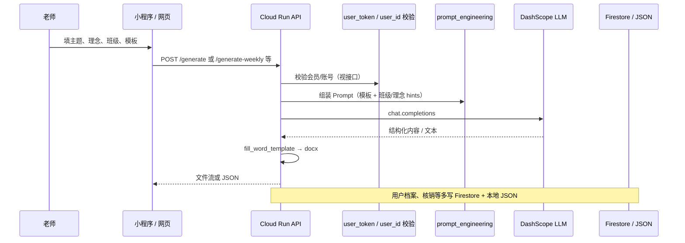
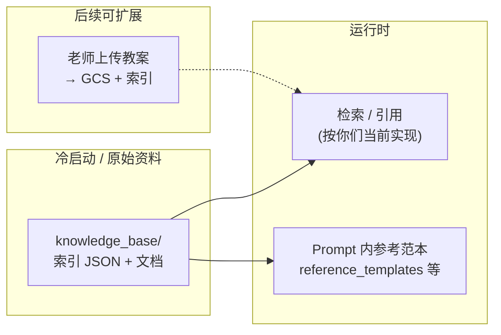
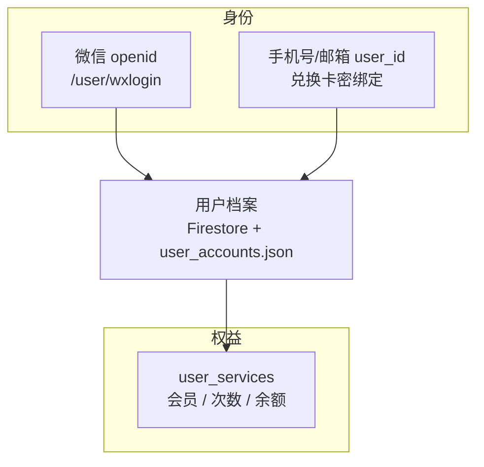

# 智伴幼师 / 纸笺 — 系统线路图（Obsidian 用）

> 将本文件复制到你的 Obsidian 库，或用 Obsidian 直接打开此仓库下的路径。  
> 需开启 **Mermaid**（Obsidian 核心插件「Mermaid」默认可渲染 ` ```mermaid ` 代码块）。

---

## 总览（用户 → 入口 → 后端）



---

## 请求链路（生成教案）



---

## 数据与知识（概念）



---

## 会员与用户（当前方向）



---

## 在 Obsidian 里怎么用

1. **把整个文件**复制进 vault，或 **添加文件夹链接** 指向本仓库 `docs/SYSTEM_ARCHITECTURE.md`。  
2. 若 Mermaid 不显示：设置 → 核心插件 → 确认 **Mermaid** 开启；或安装社区插件 **Mermaid Tools**。  
3. 想单独放大某张图：可把对应 ` ```mermaid ` 块**剪到新笔记**里编辑。

---

*文档由项目上下文整理，随架构变更请手动改图。*
